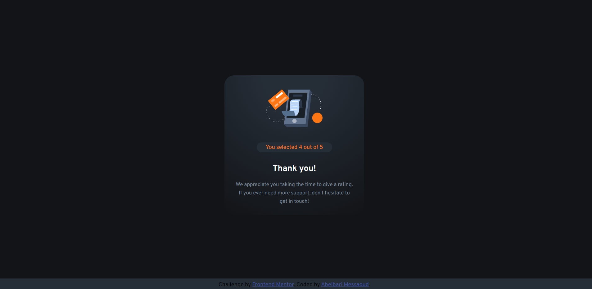
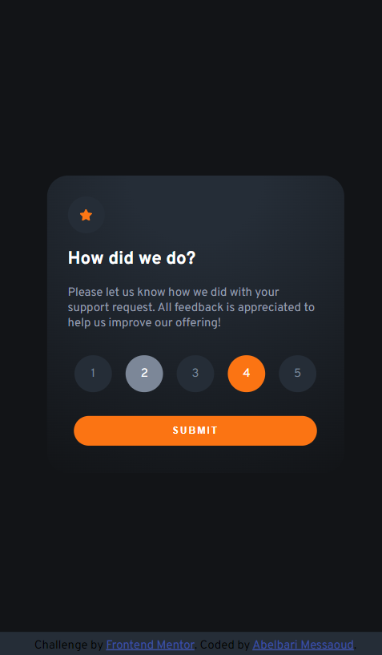

# interactive-rating-component-main

 This is a solution to the [Interactive rating component](https://www.frontendmentor.io/challenges/interactive-rating-component-koxpeBUmI) challenge on Frontend Mentor. in this project we build a dark component with some basic functionality 

## Table of contents

- [Overview](#overview)
  - [The challenge](#the-challenge)
  - [Screenshot](#screenshot)
  - [Links](#links)
- [My process](#my-process)
  - [Built with](#built-with)
  - [What I learned](#what-i-learned)
  - [Continued development](#continued-development)
  - [Useful resources](#useful-resources)
- [Author](#author)
- [Acknowledgments](#acknowledgments)

## Overview

### The challenge

Users should be able to:

- View the optimal layout for the app depending on their device's screen size
- See hover states for all interactive elements on the page
- Select and submit a number rating
- See the "Thank you" card state after submitting a rating

### Screenshots

#### desktop view




#### mobile view
<div style="display:flex; gap: 4%; width: 275px;">



</div>

### Links

- Solution URL: [Add solution URL here](https://your-solution-url.com)

## My process

### Built with

- Semantic HTML5 markup
- CSS custom properties
- Flexbox
- JavaScript 
- CSS animations


### What I learned


always seperate the code into `main` `footer` and `header` or `sections` to keep things clean

```html
<main>
  <section>
    <!-- stuff -->
  </section>
</main>
<footer>
  <!-- stuff -->
</footer>
```

always keep the functional properties near the end of the file to override already declared properties or they won't work
```css
/* near the bottom of the file or after it's initial declaration */
.hidden {
    display: none;
}

.visuallyhidden {
    opacity: 0;
}
```
learned how to wait for animation to end using the `animation` property in css.
```js
//await animation to end.
obj.addEventListener('animationend', function(e) {
  // do something cool like adding a class or removing one
  }, {
    capture: false,
    once: true,
    passive: false
  });
```

### Continued development

- need to work on animations and transitions since I am not very comfortable with applying those just yet.

- JS maniuplation is a still proving a bit difficult but I am getting the hang of it, still need to do more practice.

- need to learn to use more `event listeners` rather than using `onclick` on the actual element to better manipulate javascript.

### Useful resources

- [animate.css](https://animate.style/) - this site helped me figure out animations. Very minimalistic which I liked.
- [impressive Webs](https://www.impressivewebs.com/animate-display-block-none/) - This is an amazing article which helped me finally understand how to animate fading opacity then display none feature. highly recommend taking a look at it if you are facing problems with animating a fading or hiding element.


## Author
- Frontend Mentor - [@barimess](https://www.frontendmentor.io/profile/barimess
- Twitter - [@barimess1](https://www.twitter.com/barimess1)
